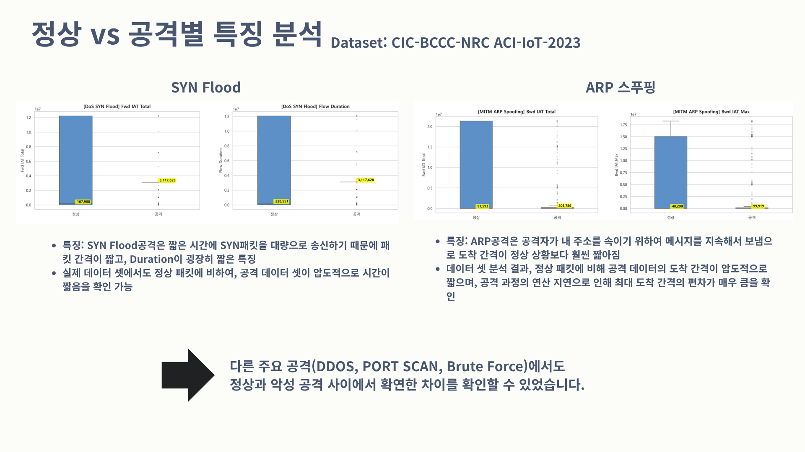
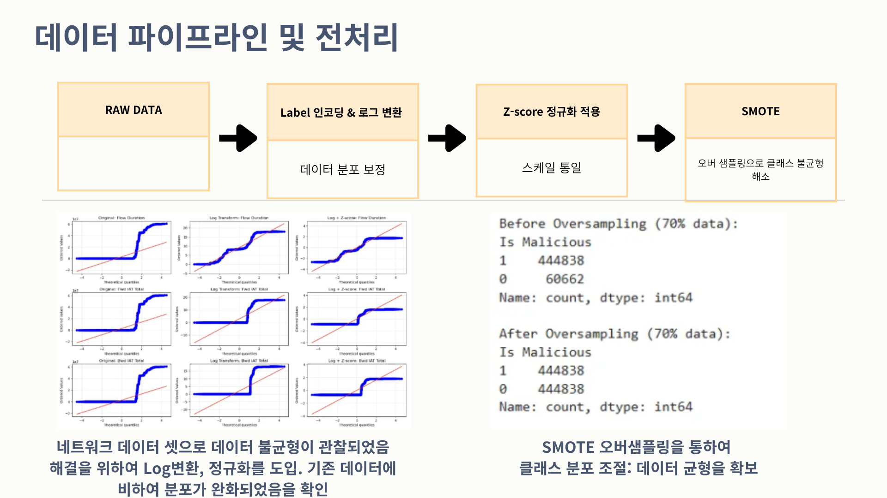
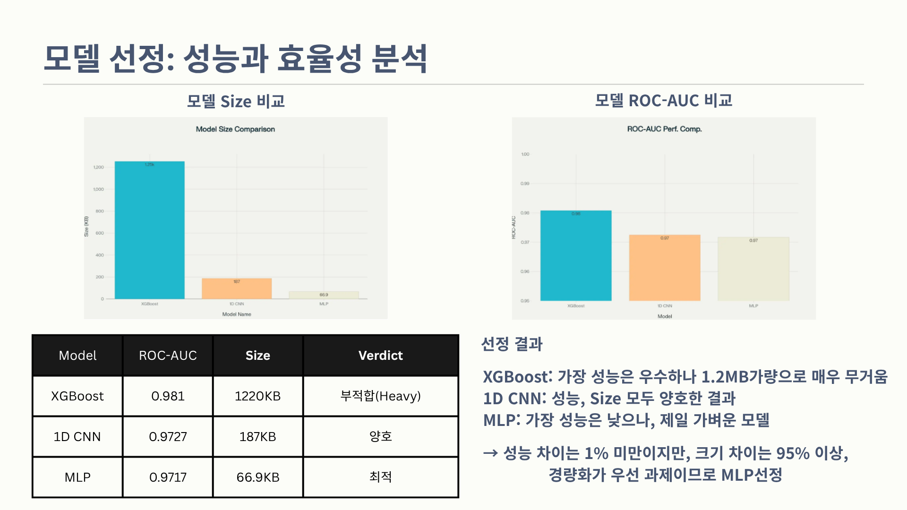
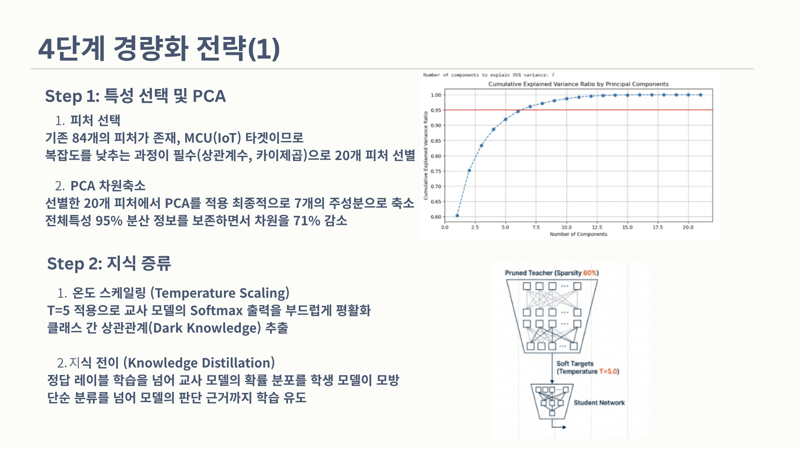
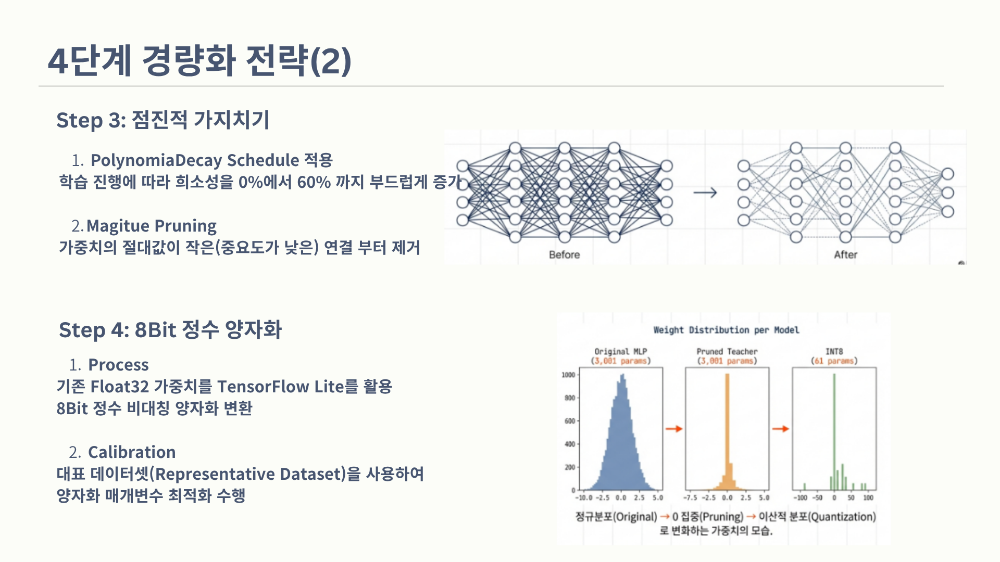
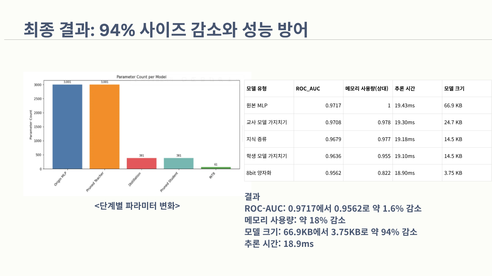
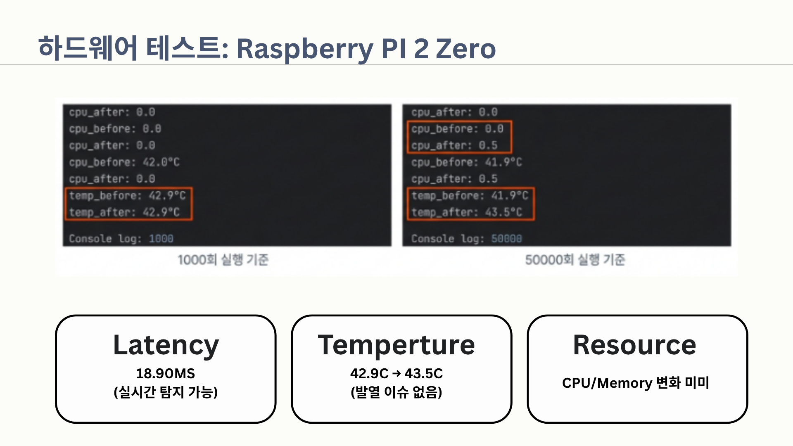
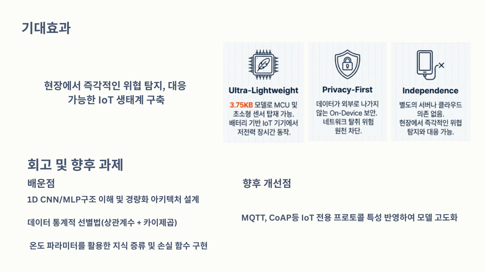

# 경량화 MLP 기반 IoT 침입 탐지 시스템

> [📄 포트폴리오 PDF 보기](<.assets/IoT PPT버전.pdf>)

## 프로젝트 배경

가정과 산업 현장에서 IoT 기기 보급이 빠르게 늘어나면서, 개인정보 유출과 해킹 사고도 함께 증가하고 있습니다. 하지만 대부분의 IoT 기기는 CPU, 메모리, 배터리 등 자원이 극도로 제한되어 있어서 기존 침입 탐지 시스템(IDS)을 그대로 올려서 구동하기가 어렵습니다.

이 프로젝트는 클라우드 전송 없이 기기 자체에서 네트워크 위협을 탐지하고, 최소한의 메모리와 배터리 소모만으로 동작하는 경량 침입 탐지 모델을 만드는 것을 목표로 합니다. 최종적으로 Raspberry Pi Zero 급 초소형 보드에서도 실시간 추론이 가능한 수준까지 모델을 줄였습니다.

---

## 정상 vs 공격별 특징 분석

<p align="center">
  
</p>

CIC-BCCC-NRC ACI-IoT-2023 데이터셋을 기반으로 정상 트래픽과 공격 트래픽 간 피처 차이를 분석했습니다. SYN Flood은 패킷 간격과 Duration이 정상 대비 압도적으로 짧고, ARP Spoofing은 도착 간격의 편차가 크게 나타납니다. DDOS, Port Scan, Brute Force 등 다른 공격 유형에서도 정상과의 차이가 뚜렷하게 확인되었습니다.

---

## 데이터 파이프라인 및 전처리

<p align="center">
  
</p>

RAW DATA → Label 인코딩 & 로그 변환 → Z-score 정규화 → SMOTE 오버샘플링 순서로 전처리를 진행했습니다. 네트워크 트래픽 데이터 특성상 분포가 심하게 치우쳐 있어서 Log 변환과 정규화로 분포를 보정하고, 정상/공격 간 클래스 불균형은 SMOTE로 해소했습니다.

---

## 모델 선정: 성능과 효율성 분석

<p align="center">
  
</p>

XGBoost, 1D CNN, MLP 세 모델을 비교했습니다. XGBoost는 ROC-AUC 0.981로 가장 높지만 모델 크기가 1,220KB로 IoT 기기에 올리기엔 무겁습니다. 1D CNN은 성능과 크기 모두 양호했고, MLP는 성능은 가장 낮지만 66.9KB로 가장 가볍습니다. 모델 간 성능 차이가 1% 미만인 반면 크기 차이는 95% 이상이라, 경량화가 최우선인 본 프로젝트에서는 MLP를 선정했습니다.

---

## 4단계 경량화 전략 (1) - 특성 선택 / 지식 증류

<p align="center">
  
</p>

Step 1에서 84개 피처 중 상관계수와 카이제곱 기반으로 20개를 선별한 뒤, PCA를 적용해 7개 주성분으로 축소했습니다. 전체 분산의 95%를 유지하면서 차원을 71% 줄였습니다.

Step 2에서는 Knowledge Distillation을 적용했습니다. Temperature=5로 교사 모델의 Softmax 출력을 부드럽게 만들어 Dark Knowledge를 추출하고, 학생 모델이 이를 모방하도록 학습시켰습니다.

---

## 4단계 경량화 전략 (2) - 가지치기 / 양자화

<p align="center">
  
</p>

Step 3에서 PolynomialDecay Schedule을 적용한 Progressive Pruning으로 희소성을 0%에서 60%까지 점진적으로 높였습니다. 가중치 절대값이 작은(중요도가 낮은) 연결부터 순차적으로 제거하는 방식입니다.

Step 4에서 TensorFlow Lite를 활용해 Float32 가중치를 8Bit 정수로 비대칭 양자화 변환했습니다. 대표 데이터셋(Representative Dataset)으로 캘리브레이션을 수행하여 양자화 매개변수를 최적화했습니다.

---

## 최종 결과

<p align="center">
  
</p>

| 모델 유형 | ROC-AUC | 메모리 사용량(상대) | 추론 시간 | 모델 크기 |
|---------|---------|-------------|--------|--------|
| 원본 MLP | 0.9717 | 1 | 19.43ms | 66.9KB |
| 교사 모델 가지치기 | 0.9708 | 0.978 | 19.30ms | 24.7KB |
| 지식 증류 | 0.9679 | 0.977 | 19.18ms | 14.5KB |
| 학생 모델 가지치기 | 0.9636 | 0.955 | 19.10ms | 14.5KB |
| 8bit 양자화 | 0.9562 | 0.822 | 18.90ms | 3.75KB |

ROC-AUC는 0.9717에서 0.9562로 약 1.6% 감소에 그쳤고, 모델 크기는 66.9KB에서 3.75KB로 약 94% 줄었습니다. 메모리 사용량도 약 18% 감소했습니다.

---

## 하드웨어 테스트: Raspberry Pi 2 Zero

<p align="center">
  
</p>

실제 Raspberry Pi 2 Zero에서 1,000회 및 50,000회 추론 테스트를 수행했습니다. 추론 지연 시간 18.90ms로 실시간 탐지가 가능하고, 온도는 42.9°C → 43.5°C로 발열 이슈가 없었습니다. CPU와 메모리 사용량 변화도 미미한 수준이었습니다.

---

## 기대효과 및 향후 과제

<p align="center">
  
</p>

3.75KB 모델로 MCU 및 배터리 기반 IoT 기기에서 저전력 장시간 동작이 가능합니다. 데이터가 외부로 나가지 않는 On-Device 보안 구조로 네트워크 탈취 위험을 원천 차단하고, 별도 서버나 클라우드 의존 없이 현장에서 즉각적인 위협 탐지와 대응이 가능합니다.

향후에는 MQTT, CoAP 등 IoT 전용 프로토콜 특성을 반영하여 모델을 고도화할 계획입니다.

---

## 파일 구조

```
├── 1d_cnn_Model.ipynb                              # 1D CNN 모델 구현
├── XGB_Model.ipynb                                  # XGBoost 모델 구현
├── traffic_Detection_Model_Lightweighting.ipynb     # 경량화 모델 구현
└── .assets/IoT PPT버전.pdf                           # 프로젝트 상세 문서
```

## 실행 환경

traffic_Detection_Model_Lightweighting.ipynb는 TensorFlow Addons를 사용합니다. TensorFlow Addons는 2024년 5월 이후 개발이 종료되어 최신 Google Colab에서는 실행되지 않습니다. 로컬 환경에서 아래 버전을 설치한 뒤 실행해야 합니다.

```bash
pip install tensorflow==2.11.0
pip install tensorflow-addons==0.19.0
pip install scikit-learn pandas numpy
```

## 데이터셋

- CIC-BCCC-NRC: 84개 피처를 가진 IoT 침입 탐지 데이터셋
- ACI-IoT-2023: IoT 환경 네트워크 트래픽 데이터